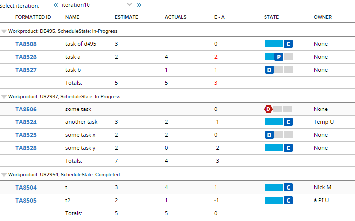

Tasks of Iteration grouped by WorkProduct with Estimates and Actuals
=========================

## Overview

If you use TimeSpent attribute on tasks, the code can be modified to include that column.

E-A (Estimate minus Actuals) column's data is calculated as follows:
If Actuals value is null (the value is currently not set) the difference defaults to 0 regardless of the Estimate value.
(TA8508 and TA8506 in the screenshot)
If Estimate value is null (the value is currently not set) but the Actuals value is set, the defference defaults to the Actuals value.
(TA8527 in the screenshot)

When there are not tasks in the selected iteration:

## License

AppTemplate is released under the MIT license.  See the file [LICENSE](./LICENSE) for the full text.

##Documentation for SDK

You can find the documentation on our help [site.](https://help.rallydev.com/apps/2.0rc3/doc/)
