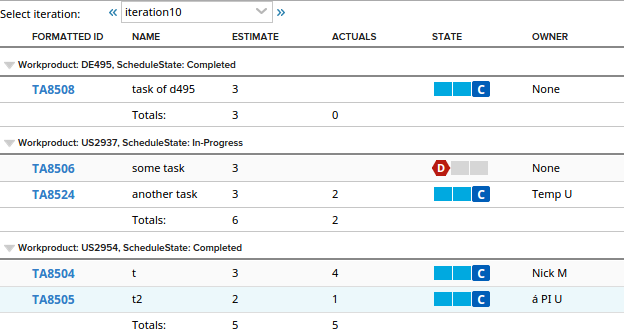
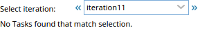

Tasks of Iteration grouped by WorkProduct with Estimates and Actuals
=========================

## Overview

If you use TimeSpent attribute on tasks, the code can be easily modified to include that column

When there are not tasks in the selected iteration:

## License

AppTemplate is released under the MIT license.  See the file [LICENSE](./LICENSE) for the full text.

##Documentation for SDK

You can find the documentation on our help [site.](https://help.rallydev.com/apps/2.0rc3/doc/)
